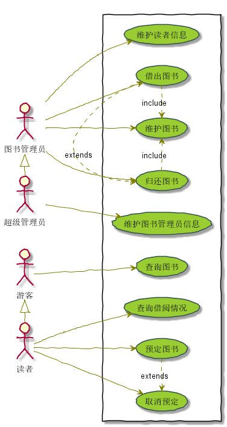
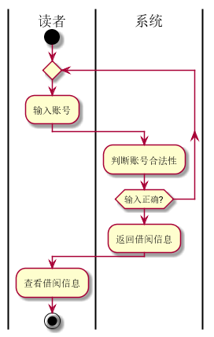
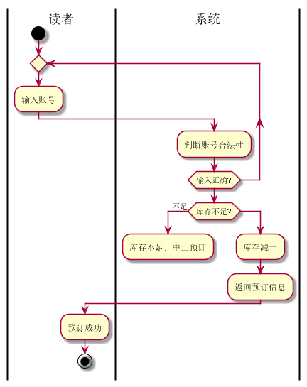
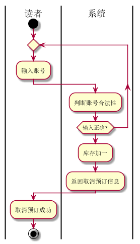
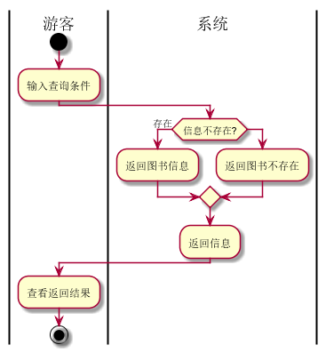
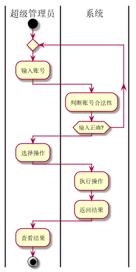
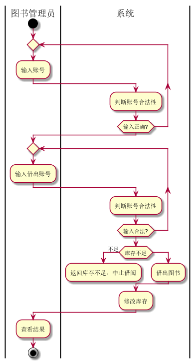
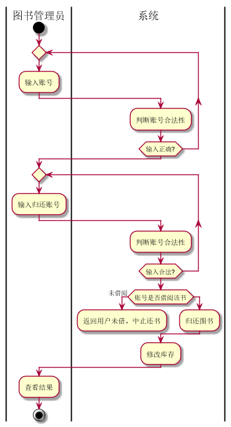
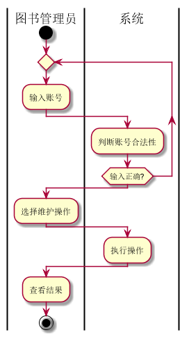

周志强的实验报告
============
##实验二（test2）：图书管理系统用例建模

|学号|班级|姓名|
|:---------------:|:------------:|:------------:|
|201510511129|软件15-1|周志强|

###1.图书管理系统整体的用例关系图

**1.1PlantUML源码如下：**
~~~
@startuml

skinparam packageStyle rectangle

:超级管理员: as root
:图书管理员: as manage
:游客: as visitor
:读者: as reader

reader <|- visitor
root <|- manage
rectangle  {
	left to right direction
	manage -> (维护图书)
	manage --> (借出图书)
	manage -> (归还图书)
	manage -> (维护读者信息)

	root --> (维护图书管理员信息)

	visitor --> (查询图书)

	reader -> (查询借阅情况)
	reader -> (预定图书)
	reader -> (取消预定)

	(借出图书) .> (归还图书) : extends
	(预定图书) .> (取消预定) : extends
	(借出图书) .> (维护图书) : include
	(归还图书) .> (维护图书) : include

}

skinparam handwritten true
skinparam usecase {
	BackgroundColor YellowGreen
	BorderColor DarkSlateGray
	ArrowColor Olive
	ActorBorderColor black
	ActorFontName Courier

}
@enduml
~~~

**1.2用例关系图如下：**

###2.参与者说明

**2.1超级管理员**

主要职责是：维护图书管理员的身份信息，并拥有图书管理员所有功能。

**2.2图书管理员：**

主要职责是：维护图书，读者信息，负责图书的借还。

**2.3读者**

主要职责是：查询图书，借阅信息，具有预订和取消预订图书功能。

**2.4游客**

主要职责是：只具有查询图书的功能。

###3.用例的规约表

**3.1“查询借阅信息”用例**

**3.1.1“查询借阅信息”用例规约**

|用例名称|查询借阅信息|
|:-----------:|:-----------------------:|
|参与者|读者|
|前置条件|读者登录到系统|
|后置条件|查询到读者借阅情况|
|主事件流|
|参与者动作|系统行为|
|1.读者输入账号查询| 2.系统确认账号，并返回借阅信息|
|备选事件流|
|1a.账号错误 1.系统提示账号错误，重新输入|
|业务规则|
|1.系统允许多个读者同时查询借阅信息，并对应返回 2.读者只能查询自己的借阅信息|

**3.1.2“查询借阅信息”用例流程图源码如下**
~~~
@startuml
|读者|
start
repeat
:输入账号;
	|系统|
	:判断账号合法性;
repeat while (输入正确?)

:返回借阅信息;
|读者|
:查看借阅信息;

stop
@enduml
~~~

**3.1.3“查询借阅信息”用例流程图如下**

**3.2“预订图书”用例**

**3.2.1“预定图书”用例规约**

|用例名称|预定图书|
|:-----------:|:-----------------------:|
|参与者|读者|
|前置条件|读者登录到系统|
|后置条件|预定图书成功|
|主事件流|
|参与者动作|系统行为|
|1.读者输入账号预订    5.预订成功| 2.系统确认账号 3.系统确认库存是否充足 4.系统修改图书库存|
|备选事件流|
|1a.账号错误 1.系统提示账号错误，重新输入2a.库存不足 2.系统提示库存不足，中止预订|
|业务规则|
|1.系统允许多个读者同时预订图书，并根据库存对应返回是否成功 2.读者只能预订有库存的图书|

**3.2.2“预定图书”用例流程图源码如下：**
~~~
@startuml
|读者|
start
repeat
	:输入账号;
	|系统|
	:判断账号合法性;
repeat while (输入正确?)
if(库存不足?) then (不足)
	:库存不足，中止预订;
	detach
else
	:库存减一;
:返回预订信息;
|读者|
:预订成功;

stop
@enduml
~~~

**3.2.3“预订图书”用例流程图如下**

**3.3“取消预定”用例**

**3.3.1“取消预定”用例规约**

|用例名称|取消预定|
|:-----------:|:-----------------------:|
|参与者|读者|
|前置条件|读者登录到系统|
|后置条件|取消预定图书成功|
|主事件流|
|参与者动作|系统行为|
|1.读者输入账号取消预订   4.取消预订成功| 2.系统确认账号 3.系统修改图书库存|
|备选事件流|
|1a.账号错误 1.系统提示账号错误，重新输入|
|业务规则|
|1.系统允许多个读者同时取消预订图书，并根据库存对应返回是否成功 2.读者只能取消预订已预订的图书|

**3.3.2“取消预定”用例流程图源码如下：**
~~~
@startuml
|读者|
start
repeat
	:输入账号;
	|系统|
	:判断账号合法性;
repeat while (输入正确?)
if(库存不足?) then (不足)
	:库存不足，中止预订;
	detach
else
	:库存减一;
:返回预订信息;
|读者|
:预订成功;

stop
@enduml
~~~

**3.3.3“取消预订”用例流程图如下**

**3.4“查询图书信息”用例**

**3.4.1“查询图书信息”用例规约**

|用例名称|查询图书|
|:-----------:|:-----------------------:|
|参与者|游客|
|前置条件|打开系统|
|后置条件|查询图书信息成功|
|主事件流|
|参与者动作|系统行为|
|1.输入查询条件   3.查询图书结果| 2.系统查询图书信息 |
|备选事件流|
|1a.图书信息不存在 1.系统提示无图书|
|业务规则|
|1.系统允许多个游客同时查询图书，并根据信息对应返回 2.游客只能查询图书|

**3.4.2“查询图书信息”用例流程图源码如下：**
~~~
@startuml
|游客|
start
	:输入查询条件;
	|系统|
if(信息不存在?) then (存在)
	:返回图书信息;
else 
	:返回图书不存在;
endif
:返回信息;
|游客|
:查看返回结果;

stop
@enduml
~~~

**3.4.3“查询图书信息”用例流程图如下**

**3.5“维护图书管理员信息”用例**

**3.5.1“维护图书管理员信息”用例规约**

|用例名称|维护图书管理员信息|
|:-----------:|:-----------------------:|
|参与者|超级管理员|
|前置条件|登录超级管理员账号|
|后置条件|维护图书管理员信息成功|
|主事件流|
|参与者动作|系统行为|
|1.输入账号   3.选择维护动作   6.查看结果| 2.判断账号合法性 4.执行操作 5.返回结果|
|备选事件流|
|1a.账号不合法 1.系统提示账号错误|
|业务规则|
|1.系统允许超级管理员执行维护图书管理员操作|

**3.5.2“维护图书管理员信息”用例流程图源码如下：**
~~~
@startuml
|超级管理员|
start
repeat
	:输入账号;
	|系统|
	:判断账号合法性;
repeat while (输入正确?)
|超级管理员|
:选择操作;
|系统|
:执行操作;
:返回结果;

|超级管理员|
:查看结果;

stop
@enduml
~~~

**3.5.3“维护图书管理员信息”用例流程图如下**

**3.6“借出图书”用例**

**3.6.1“借出图书”用例规约**

|用例名称|借出图书|
|:-----------:|:-----------------------:|
|参与者|图书管理员|
|前置条件|登录图书管理员账号|
|后置条件|借出图书成功|
|主事件流|
|参与者动作|系统行为|
|1.输入账号   3.输入借出账号   7.查看结果| 2.判断账号合法性 4.判断账号是否合法 5.判断图书库存 6.借出图书 7.修改库存|
|备选事件流|
|1a.账号不合法 1.系统提示账号错误 2a.库存不足 系统提示库存不足|
|业务规则|
|1.系统允许图书管理员执行借出图书操作|

**3.6.2“借出图书”用例流程图源码如下：**
~~~
@startuml
|图书管理员|
start
repeat
	:输入账号;
	|系统|
	:判断账号合法性;
repeat while (输入正确?)
|图书管理员|
repeat
	:输入借出账号;
	|系统|
	:判断账号合法性;
repeat while (输入合法?)
|系统|
if (库存不足) then (不足)
	:返回库存不足，中止借阅;
	detach
else
	:借出图书;
endif
:修改库存;

|图书管理员|
:查看结果;

stop
@enduml
~~~

**3.6.3“借出图书”用例流程图如下**

       

**3.7“归还图书”用例**

**3.7.1“归还图书”用例规约**

|用例名称|归还图书|
|:-----------:|:-----------------------:|
|参与者|图书管理员|
|前置条件|登录图书管理员账号|
|后置条件|归还图书成功|
|主事件流|
|参与者动作|系统行为|
|1.输入账号   3.输入归还账号   7.查看结果| 2.判断账号合法性 4.判断账号是否合法 5.判断用户是否借入图书 6.归还图书 7.修改库存|
|备选事件流|
|1a.账号不合法 1.系统提示账号错误 2a.用户未借图书 系统提示用户未借图书|
|业务规则|
|1.系统允许图书管理员执行归还图书操作|

**3.7.2“归还图书”用例流程图源码如下：**
~~~
@startuml
|图书管理员|
start
repeat
	:输入账号;
	|系统|
	:判断账号合法性;
repeat while (输入正确?)
|图书管理员|
repeat
	:输入归还账号;
	|系统|
	:判断账号合法性;
repeat while (输入合法?)
|系统|
if (账号是否借阅该书) then (未借阅)
	:返回用户未借，中止还书;
	detach
else
	:归还图书;
endif
:修改库存;

|图书管理员|
:查看结果;

stop
@enduml
~~~

**3.7.3“归还图书”用例流程图如下**

    

 **3.8“维护图书”用例**

**3.8.1“维护图书”用例规约**

|用例名称|维护图书|
|:-----------:|:-----------------------:|
|参与者|图书管理员|
|前置条件|登录图书管理员账号|
|后置条件|维护图书成功|
|主事件流|
|参与者动作|系统行为|
|1.输入账号   3.选择维护操作  5.查看结果| 2.判断账号合法性 4.执行操作 |
|备选事件流|
|1a.账号不合法 1.系统提示账号错误 |
|业务规则|
|1.系统允许图书管理员执行维护图书操作|

**3.8.2“维护图书”用例流程图源码如下：**
~~~
@startuml
|图书管理员|
start
repeat
	:输入账号;
	|系统|
	:判断账号合法性;
repeat while (输入正确?)
|图书管理员|
:选择维护操作;
|系统|
:执行操作;

|图书管理员|
:查看结果;

stop
@enduml

~~~

**3.8.3“维护图书”用例流程图如下**

    

 **3.9“维护读者信息”用例**

**3.9.1“维护读者信息”用例规约**

|用例名称|维护读者信息|
|:-----------:|:-----------------------:|
|参与者|图书管理员|
|前置条件|登录图书管理员账号|
|后置条件|维护读者信息成功|
|主事件流|
|参与者动作|系统行为|
|1.输入账号   3.选择维护操作  5.查看结果| 2.判断账号合法性 4.执行操作 |
|备选事件流|
|1a.账号不合法 1.系统提示账号错误 |
|业务规则|
|1.系统允许图书管理员执行维护读者信息操作|

**3.9.2“维护读者信息”用例流程图源码如下：**
~~~
@startuml
|图书管理员|
start
repeat
	:输入账号;
	|系统|
	:判断账号合法性;
repeat while (输入正确?)
|图书管理员|
:选择维护操作;
|系统|
:执行操作;

|图书管理员|
:查看结果;

stop
@enduml

~~~

**3.9.3“维护读者信息”用例流程图如下**

    